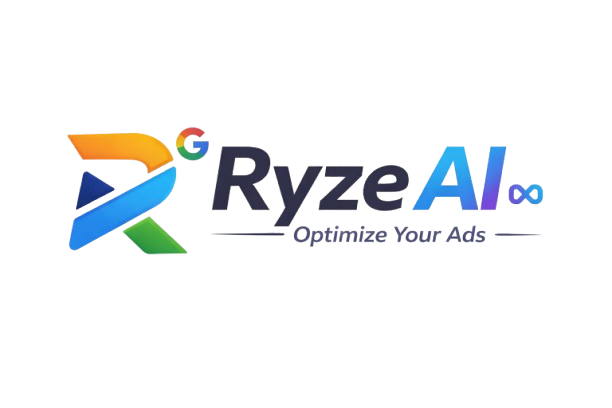

# Ryzen AI - AI-Powered Ad Automation Platform



> **AI That Runs & Optimizes Your Paid Ads Automatically**  
> Increase ROI and save hours every day with automated cross-platform ad management powered by advanced AI optimization.

---

## 📋 Table of Contents

- [Overview](#overview)
- [Features](#features)
- [Tech Stack](#tech-stack)
- [Getting Started](#getting-started)
- [Project Structure](#project-structure)
- [Pages & Routes](#pages--routes)
- [Components](#components)
- [Styling & Design](#styling--design)
- [Development](#development)
- [Build & Deployment](#build--deployment)
- [Contributing](#contributing)

---

## 🎯 Overview

Ryzen AI is a modern, conversion-optimized landing page and web application for an AI-powered advertising automation platform. The project features a professional design with glassmorphism effects, smooth animations, and a fully responsive layout.

### Key Highlights

- **Professional Design**: Modern glassmorphism UI with gradient accents
- **Fully Responsive**: Optimized for desktop, tablet, and mobile devices
- **Smooth Animations**: Powered by Framer Motion for engaging user experience
- **Modular Architecture**: Reusable components and clean code structure
- **Type-Safe**: Built with TypeScript for reliability and maintainability
- **Accessible**: Following WCAG guidelines for inclusive design

---

## ✨ Features

### Core Features

- ✅ **Automated Campaign Optimization** - AI monitors and adjusts ads 24/7
- ✅ **Cross-Platform Management** - Manage Google, Meta, LinkedIn, Reddit & more
- ✅ **Smart Budget Rebalancing** - Automatically optimize budget allocation
- ✅ **AI-Generated Creatives** - Get AI-powered ad suggestions
- ✅ **Real-Time Analytics** - Deep insights with actionable recommendations
- ✅ **Account Health Audits** - Identify wasted spend and opportunities

### Website Features

- 🎨 **Dark/Light Theme** - User-controlled theme switching
- 📱 **Mobile Navigation** - Responsive hamburger menu
- 🔄 **Smooth Scrolling** - Enhanced navigation experience
- 📊 **Interactive Pricing** - Monthly/Yearly toggle with feature comparison
- 💬 **Testimonials** - Social proof with customer reviews
- 📝 **Multi-Step Forms** - Booking form with validation and localStorage
- 🎭 **Page Transitions** - Smooth animations between pages

---

## 🛠️ Tech Stack

### Frontend Framework

- **React 18.3.1** - Modern UI library
- **TypeScript 5.8.3** - Type-safe development
- **Vite 7.3.1** - Fast build tool and dev server

### UI & Styling

- **Tailwind CSS 3.4.17** - Utility-first CSS framework
- **shadcn/ui** - High-quality React components
- **Radix UI** - Accessible component primitives
- **Framer Motion 12.24.10** - Animation library

### Routing & State

- **React Router DOM 6.30.1** - Client-side routing
- **TanStack Query 5.83.0** - Server state management
- **React Hook Form 7.61.1** - Form handling

### Icons & Graphics

- **Lucide React** - Beautiful icon library
- **Recharts** - Data visualization

### Development Tools

- **ESLint** - Code linting
- **PostCSS** - CSS processing
- **Autoprefixer** - CSS vendor prefixes

---

## 🚀 Getting Started

### Prerequisites

- **Node.js** (v18 or higher)
- **npm** or **yarn** package manager

### Installation

1. **Clone the repository**

   ```bash
   git clone <repository-url>
   cd ryzen_ai
   ```

2. **Install dependencies**

   ```bash
   npm install
   ```

3. **Start development server**

   ```bash
   npm run dev
   ```

4. **Open in browser**
   ```
   http://localhost:8080
   ```

### Available Scripts

```bash
# Start development server
npm run dev

# Build for production
npm run build

# Build for development (with source maps)
npm run build:dev

# Preview production build
npm run preview

# Run ESLint
npm run lint
```

---

## 📁 Project Structure

```
ryzen_ai/
├── public/                      # Static assets
│   ├── ryzen-ai-logo.png       # Brand logo
│   └── ...
├── src/
│   ├── components/             # React components
│   │   ├── animations/         # Animation components
│   │   │   ├── AnimatedSection.tsx
│   │   │   ├── PageLoader.tsx
│   │   │   ├── ScrollProgress.tsx
│   │   │   └── ScrollToTop.tsx
│   │   ├── layout/             # Layout components
│   │   │   ├── Header.tsx      # Main navigation header
│   │   │   └── Footer.tsx      # Site footer
│   │   ├── sections/           # Page sections
│   │   │   ├── Hero.tsx        # Homepage hero section
│   │   │   ├── Features.tsx    # Features grid
│   │   │   ├── Pricing.tsx     # Pricing tiers
│   │   │   ├── Testimonials.tsx
│   │   │   ├── HowItWorks.tsx
│   │   │   ├── DemoBookingForm.tsx
│   │   │   ├── DemoPreview.tsx
│   │   │   ├── QualificationSection.tsx
│   │   │   ├── DemoFAQ.tsx
│   │   │   ├── FinalCTA.tsx
│   │   │   ├── WallOfLove.tsx
│   │   │   ├── CTA.tsx
│   │   │   ├── Analytics.tsx
│   │   │   ├── DashboardDemo.tsx
│   │   │   └── AccountManagement.tsx
│   │   ├── ui/                 # shadcn/ui components
│   │   │   ├── button.tsx
│   │   │   ├── card.tsx
│   │   │   ├── input.tsx
│   │   │   ├── accordion.tsx
│   │   │   └── ... (30+ components)
│   │   └── ThemeToggle.tsx     # Dark/light mode toggle
│   ├── hooks/                  # Custom React hooks
│   │   ├── use-mobile.tsx
│   │   ├── use-toast.ts
│   │   └── useSmoothScroll.tsx
│   ├── lib/                    # Utility functions
│   │   └── utils.ts
│   ├── pages/                  # Route pages
│   │   ├── Index.tsx           # Homepage
│   │   ├── HowItWorksPage.tsx  # How It Works page
│   │   ├── BookDemo.tsx        # Demo booking page
│   │   ├── Login.tsx           # Login page
│   │   ├── SignUp.tsx          # Sign up page
│   │   └── NotFound.tsx        # 404 page
│   ├── App.tsx                 # Root component with routing
│   ├── main.tsx                # Application entry point
│   └── index.css               # Global styles
├── .eslintrc.json              # ESLint configuration
├── tailwind.config.ts          # Tailwind CSS configuration
├── tsconfig.json               # TypeScript configuration
├── vite.config.ts              # Vite configuration
└── package.json                # Project dependencies
```

---

## 🌐 Pages & Routes

### 1. Homepage (`/`)

**Route:** `/`  
**Component:** `src/pages/Index.tsx`

The main landing page featuring:

#### Sections

1. **Hero Section** - Compelling headline with animated counters and CTAs

   - Main headline: "AI That Runs & Optimizes Your Paid Ads Automatically"
   - Animated statistics (ROI increase, time saved, optimization speed)
   - Primary CTA: "Book a Demo"
   - Secondary CTA: "See It in Action"
   - Platform logos (Google Ads, Meta, LinkedIn, Reddit, ChatGPT, Perplexity)

2. **Features Section** - 6 feature cards with gradient icons

   - Automated Campaign Optimization
   - Cross-Platform Management
   - Smart Budget Rebalancing
   - AI-Generated Creatives
   - Real-Time Analytics
   - Account Health Audits

3. **Wall of Love** - Social proof with customer testimonials

4. **Testimonials** - Detailed customer success stories

5. **Pricing Section** - Three pricing tiers with monthly/yearly toggle

   - Starter Plan ($299/month)
   - Growth Plan ($799/month) - Most Popular
   - Agency Plan ($1,999/month)

6. **Final CTA** - Conversion-focused call-to-action

---

### 2. How It Works (`/how-it-works`)

**Route:** `/how-it-works`  
**Component:** `src/pages/HowItWorksPage.tsx`

Explains the platform's process and functionality:

#### Sections

1. **Hero Section** - Page introduction with CTAs

   - Heading: "How Ryzen AI Works"
   - Description of AI-powered platform
   - "Book a Demo" and "Login" buttons

2. **How It Works** - 3-step process explanation

   - Step 1: Connect Your Accounts
   - Step 2: AI Takes Over
   - Step 3: Watch Performance Soar

3. **Dashboard Demo** - Interactive dashboard preview

   - Live metrics visualization
   - Feature highlights

4. **Analytics Section** - Real results showcase
   - Performance metrics
   - Success statistics

---

### 3. Book a Demo (`/book-demo`)

**Route:** `/book-demo`  
**Component:** `src/pages/BookDemo.tsx`

Professional demo booking page with conversion optimization:

#### Sections

1. **Split-Layout Hero**

   - Left: Headline, subtext, trust indicators
   - Right: Animated dashboard preview
   - Trust badges: "30-minute demo", "No credit card", "Tailored for you"

2. **Multi-Step Booking Form**

   - **Step 1: Basic Info**
     - Name, Email, Company, Role
   - **Step 2: Business Context**
     - Monthly ad spend, Platforms, Goals
   - Form validation with error messages
   - localStorage persistence for partial saves
   - Success modal on submission

3. **What You'll See in Demo**

   - 4 feature cards:
     - Live Ad Account Audit
     - Real-Time AI Optimization
     - Cross-Platform Dashboard
     - Budget Rebalancing in Action

4. **Who This Demo Is For**

   - Two-column qualification section
   - "Great Fit" vs "Not Ideal For"
   - Lead quality improvement

5. **Social Proof**

   - 5-star testimonial
   - Customer avatar and details
   - Logo strip of trusted companies

6. **FAQ Section**

   - Accordion-style UI
   - 5 common questions:
     - How long is the demo?
     - Is it sales-heavy?
     - Do I need to connect my ad account?
     - Is my data secure?
     - Can my team join?

7. **Final CTA**
   - "Still Not Sure?" reassurance
   - Book a Demo button
   - Trust badges

---

### 4. Login (`/login`)

**Route:** `/login`  
**Component:** `src/pages/Login.tsx`

Card-based authentication page:

#### Features

- Email/password login form
- "Remember me" checkbox
- "Forgot password?" link
- Social login options (Google, GitHub)
- Link to sign up page
- Form validation
- Responsive card design

---

### 5. Sign Up (`/signup`)

**Route:** `/signup`  
**Component:** `src/pages/SignUp.tsx`

User registration page:

#### Features

- Full name, email, password fields
- Password strength indicator
- Terms and conditions checkbox
- Social sign-up options
- Link to login page
- Form validation
- Success confirmation

---

### 6. 404 Not Found

**Route:** `*` (catch-all)  
**Component:** `src/pages/NotFound.tsx`

Custom 404 error page with navigation back to homepage.

---

## 🧩 Components

### Layout Components

#### Header (`src/components/layout/Header.tsx`)

- Sticky navigation bar
- Logo with link to homepage
- Desktop navigation menu
- Mobile hamburger menu
- Theme toggle (dark/light mode)
- Login and "Book a Demo" CTAs
- Active section highlighting
- Smooth scroll behavior

#### Footer (`src/components/layout/Footer.tsx`)

- Multi-column layout
- Quick links
- Social media icons
- Legal links (Privacy, Terms)
- Newsletter signup
- Copyright information

---

### Section Components

All section components are located in `src/components/sections/` and are designed to be:

- **Self-contained**: Independent functionality
- **Reusable**: Can be used across different pages
- **Responsive**: Mobile-first design
- **Animated**: Smooth entrance animations

Key sections include:

- `Hero.tsx` - Homepage hero with animated counters
- `Features.tsx` - Feature grid with hover effects
- `Pricing.tsx` - Pricing tiers with toggle
- `Testimonials.tsx` - Customer testimonials carousel
- `HowItWorks.tsx` - 3-step process explanation
- `DemoBookingForm.tsx` - Multi-step form with validation

---

### Animation Components

#### PageLoader (`src/components/animations/PageLoader.tsx`)

- Full-screen loading animation
- Displays on initial page load
- Smooth fade-out transition

#### ScrollProgress (`src/components/animations/ScrollProgress.tsx`)

- Progress bar at top of page
- Shows scroll position
- Gradient color scheme

#### ScrollToTop (`src/components/animations/ScrollToTop.tsx`)

- Floating button
- Appears after scrolling down
- Smooth scroll to top

#### AnimatedSection (`src/components/animations/AnimatedSection.tsx`)

- Intersection Observer-based animations
- Fade-in and slide-up effects
- Stagger animations for lists

---

### UI Components

Located in `src/components/ui/`, these are shadcn/ui components:

- `button.tsx` - Multiple variants (default, hero, outline, ghost)
- `card.tsx` - Container component
- `input.tsx` - Form input field
- `accordion.tsx` - Collapsible content
- `dialog.tsx` - Modal dialogs
- `tabs.tsx` - Tab navigation
- `toast.tsx` - Notification system
- And 30+ more components

---

## 🎨 Styling & Design

### Design System

#### Colors

```css
/* Primary Gradient */
--primary: #00C2FF → Dark Blue

/* Accent Colors */
--accent: Various gradients for features

/* Background */
--background: White (light) / Dark (dark mode)

/* Text */
--foreground: Dark (light) / Light (dark mode)
--muted-foreground: Gray tones
```

#### Typography

- **Display Font**: Bold, large headings
- **Body Font**: Clean sans-serif
- **Font Sizes**: Responsive scale (text-sm to text-7xl)

#### Spacing

- Consistent padding/margin scale
- Container max-width: 1280px
- Section padding: py-24 (desktop), py-16 (mobile)

#### Effects

- **Glassmorphism**: `backdrop-blur-md` with transparency
- **Gradients**: Linear gradients for buttons and accents
- **Shadows**: Subtle shadows for depth
- **Hover Effects**: Scale and color transitions

---

### Tailwind Configuration

Key customizations in `tailwind.config.ts`:

```typescript
{
  theme: {
    extend: {
      colors: {
        primary: "hsl(var(--primary))",
        accent: "hsl(var(--accent))",
        // ... more colors
      },
      fontFamily: {
        display: ["var(--font-display)"],
      },
      animation: {
        // Custom animations
      }
    }
  }
}
```

---

## 💻 Development

### Code Style

- **TypeScript**: Strict mode enabled
- **ESLint**: Configured for React and TypeScript
- **Formatting**: Consistent code formatting
- **Component Structure**: Functional components with hooks

### Best Practices

1. **Component Organization**

   - One component per file
   - Named exports for components
   - Props interfaces defined inline or separately

2. **State Management**

   - React hooks for local state
   - TanStack Query for server state
   - localStorage for persistence

3. **Performance**

   - Code splitting with React Router
   - Lazy loading for images
   - Optimized animations with Framer Motion

4. **Accessibility**
   - Semantic HTML elements
   - ARIA labels where needed
   - Keyboard navigation support
   - Focus management

---

## 🏗️ Build & Deployment

### Production Build

```bash
# Create optimized production build
npm run build

# Output directory: dist/
```

### Build Output

The build process creates:

- Minified JavaScript bundles
- Optimized CSS files
- Static HTML files
- Compressed assets

### Deployment Options

1. **Vercel** (Recommended)

   ```bash
   vercel deploy
   ```

2. **Netlify**

   ```bash
   netlify deploy --prod
   ```

3. **Static Hosting**
   - Upload `dist/` folder to any static host
   - Configure routing for SPA

### Environment Variables

Create `.env` file for environment-specific configuration:

```env
VITE_API_URL=your_api_url
VITE_APP_NAME=Ryzen AI
```

---

## 🤝 Contributing

### Development Workflow

1. **Fork the repository**
2. **Create a feature branch**
   ```bash
   git checkout -b feature/your-feature-name
   ```
3. **Make your changes**
4. **Test thoroughly**
5. **Commit with clear messages**
   ```bash
   git commit -m "Add: feature description"
   ```
6. **Push to your fork**
   ```bash
   git push origin feature/your-feature-name
   ```
7. **Create a Pull Request**

### Commit Message Format

- `Add:` New features
- `Fix:` Bug fixes
- `Update:` Updates to existing features
- `Refactor:` Code refactoring
- `Style:` Styling changes
- `Docs:` Documentation updates

---

## 📄 License

This project is private and proprietary.

---

## 📞 Support

For questions or support:

- **Email**: support@ryzenai.com
- **Documentation**: [docs.ryzenai.com](https://docs.ryzenai.com)
- **Issues**: GitHub Issues

---

## 🎯 Project Status

**Current Version:** 1.0.0  
**Status:** ✅ Production Ready  
**Last Updated:** January 2026

### Recent Updates

- ✅ Complete homepage redesign
- ✅ Book Demo page with multi-step form
- ✅ How It Works dedicated page
- ✅ Login/SignUp pages
- ✅ Dark/Light theme support
- ✅ Mobile responsiveness improvements
- ✅ Accessibility enhancements

---

## 🙏 Acknowledgments

- **shadcn/ui** - For the beautiful component library
- **Radix UI** - For accessible primitives
- **Framer Motion** - For smooth animations
- **Lucide** - For the icon library
- **Tailwind CSS** - For the utility-first CSS framework

---


